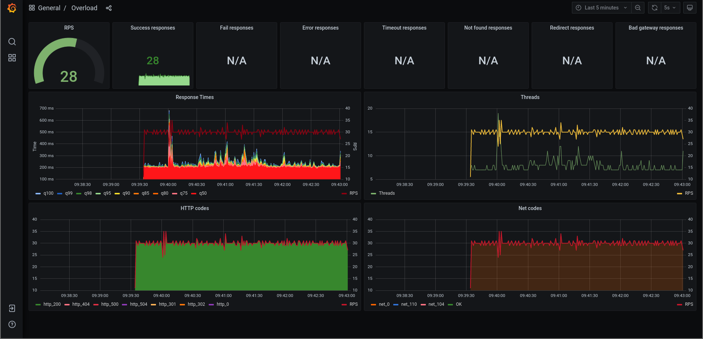
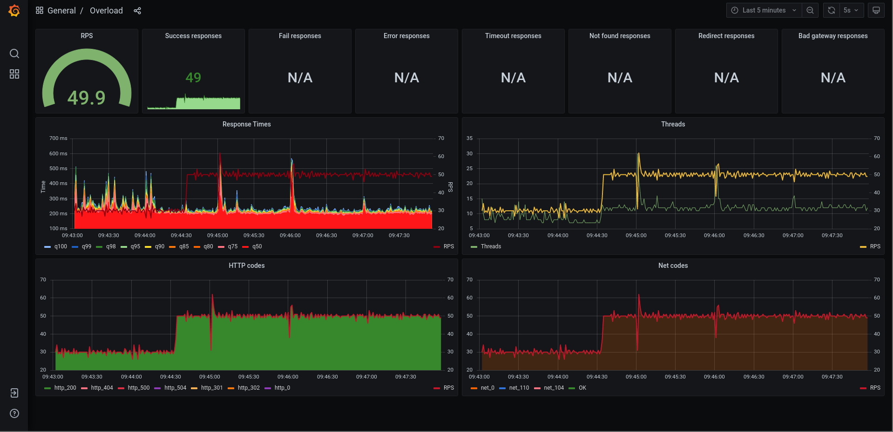
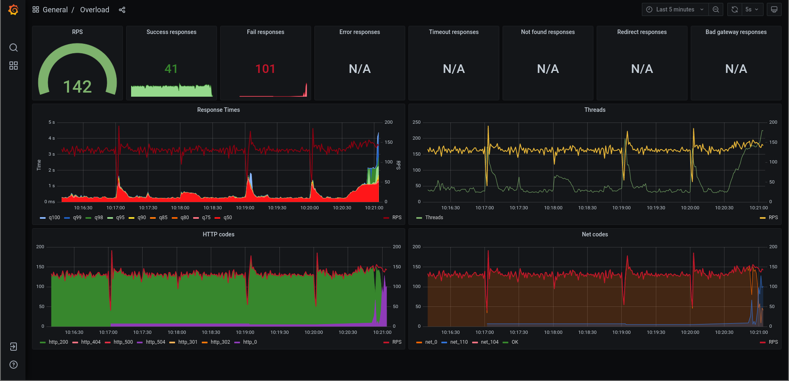

## Yandex.Tank + InfluxDB + Grafana

### How to run it?

1. Clone the repository to your localhost or your EC2:

```
$ git clone https://github.com/azamaschikov/yandex-tank.git && cd Tank
```

2. Setup target host for Tank:

```
$ vim yandex-tank/config.yml

phantom:
address: example.me:443
ssl: true
ammofile: bullets
ammo_type: uri
load_profile:
load_type: rps
schedule: step(30, 300, 20, 5m)
header_http: "1.1"
headers:
- "[Host: example.com]"
- "[Accept-Encoding: gzip, deflate]"
```

2. Setup bullets for Tank:

```
$ vim yandex-tank/bullets

[Connection: close]
[Cookie: None]

/
/about.php
/some-handler.php
```

3. Start Yandex.Tank:

```$ source docker-start.sh```

4. Open Grafana at link — http://localhost:3000 (or real IP-address rather localhost).




